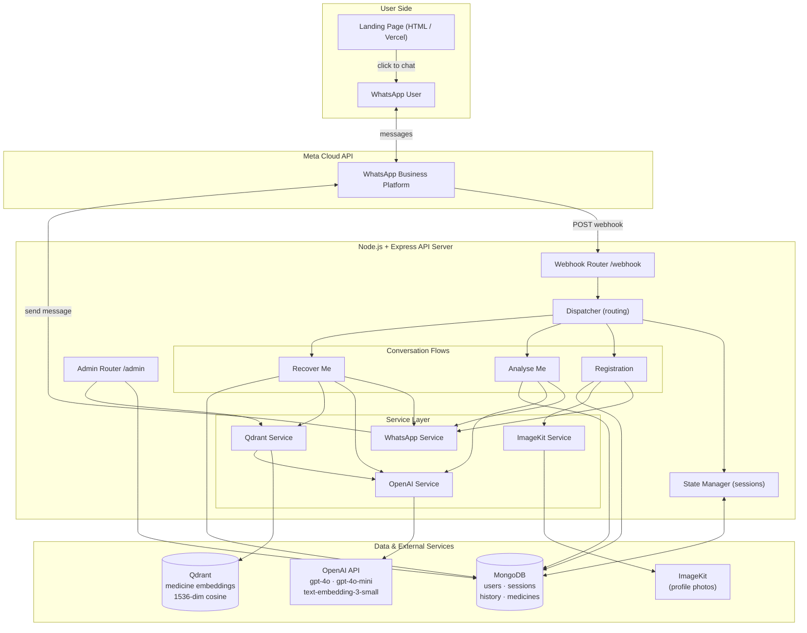
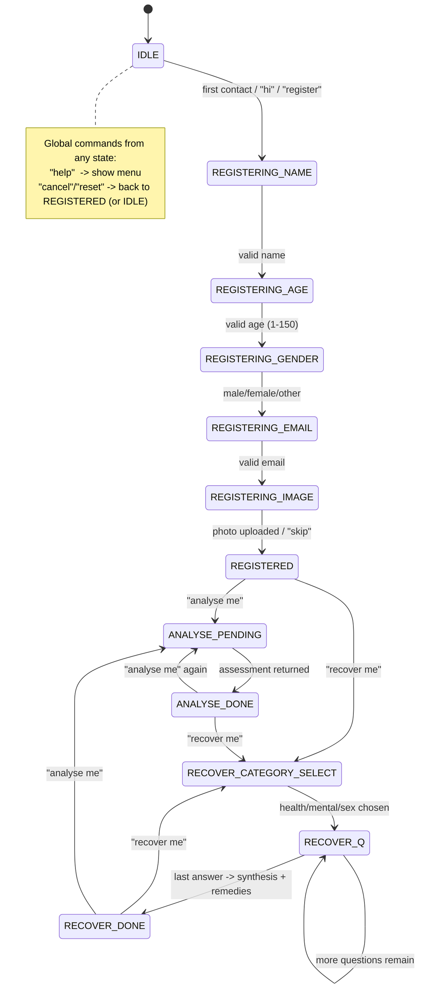

# WhatChat — WhatsApp AI Health Chatbot

**Version:** 1.0.0
**Prepared:** 2026-06-07
**Stack:** Node.js · Express · MongoDB · Qdrant (Vector DB) · OpenAI · ImageKit · WhatsApp (Meta Cloud API)

---

WhatChat is a stateful WhatsApp chatbot that delivers AI-powered health and wellness guidance. Users interact entirely through WhatsApp — there is no separate mobile app. A lightweight HTML landing page (hostable on Vercel) deep-links users into a WhatsApp chat.

The product delivers three core journeys:

1. **Registration** — a guided, multi-turn chat collects the user's name, age, gender, email, and an optional profile photo (uploaded to ImageKit).
2. **Analyse Me** — the user's profile and photo are sent to OpenAI (GPT-4o vision) for an initial wellness assessment, and a recommended support category is detected.
3. **Recover Me** — the user picks a category (Health, Mental, Sex), answers a fixed questionnaire, and receives an AI-synthesised recovery plan plus semantically-matched remedy recommendations retrieved from a Qdrant vector knowledge base.

A curated medicine knowledge base is seeded from JSON and is fully editable at runtime via secured admin REST endpoints.

---

## 1. Architecture Diagram



### Component responsibilities

| Layer   | Component         | Responsibility                                                                                |
| ------- | ----------------- | --------------------------------------------------------------------------------------------- |
| Entry   | `webhook.js`      | Verifies Meta webhook, acks within 20s, parses inbound messages, dispatches async             |
| Entry   | `admin.js`        | Secured CRUD + seed endpoints for the medicine KB                                             |
| Routing | `dispatcher.js`   | Loads session, handles global commands (`help`/`cancel`), routes to the correct flow by state |
| State   | `stateManager.js` | Loads / saves / resets per-user session (MongoDB)                                             |
| Flow    | `registration.js` | Step-by-step profile capture + photo upload                                                   |
| Flow    | `analyseMe.js`    | Builds prompt, calls OpenAI vision, stores history, detects category                          |
| Flow    | `recoverMe.js`    | Category selection → questionnaire → GPT synthesis + Qdrant search                            |
| Service | `whatsapp.js`     | Send text, download media (Meta Graph API)                                                    |
| Service | `openai.js`       | Analysis, recovery synthesis, category detection, embeddings                                  |
| Service | `qdrant.js`       | Collection init, upsert, semantic search, delete                                              |
| Service | `imagekit.js`     | Upload profile photos, return public URL                                                      |

---

## 2. Functional Diagram — Conversation State Machine

Each user has a session document holding `state`, `category`, `registrationBuffer`, `recoverAnswers[]`, and `currentQuestion`.



### Recovery categories & question counts

| Category | Focus                       | # Questions |
| -------- | --------------------------- | ----------- |
| `health` | Physical / Pain Management  | 5           |
| `mental` | Mental / Emotional Wellness | 7           |
| `sex`    | Sexual Health & Wellness    | 5           |

---

**Qdrant collection** `medicines`: 1536-dim vectors, cosine distance. Each point's payload mirrors `{ name, description, category, tags, source }`; the embedding is generated from `"{name}. {description}. Tags: {tags}."`.

> Note: `MEDICINE.category` uses the values `physical|mental|chronic`, while the recovery flow categories are `health|mental|sex`. See §9.

---

## 3. API Reference

### Public / system

| Method | Path       | Auth           | Description                                |
| ------ | ---------- | -------------- | ------------------------------------------ |
| GET    | `/`        | —              | Serves landing page (`website/index.html`) |
| GET    | `/health`  | —              | Health check (uptime, Mongo status)        |
| GET    | `/webhook` | verify token   | Meta webhook verification (hub challenge)  |
| POST   | `/webhook` | Meta signature | Inbound WhatsApp messages                  |

### Admin (medicine KB)

| Method | Path                    | Auth                   | Description                               |
| ------ | ----------------------- | ---------------------- | ----------------------------------------- |
| POST   | `/admin/token`          | `ADMIN_SECRET` in body | Exchange secret for a 24h admin JWT       |
| POST   | `/admin/medicines/seed` | admin JWT              | Bulk-seed from `data/medicines_seed.json` |
| GET    | `/admin/medicines`      | admin JWT              | List (paginated, filter by category)      |
| POST   | `/admin/medicines`      | admin JWT              | Add one medicine                          |
| PUT    | `/admin/medicines/:id`  | admin JWT              | Update (re-embeds in Qdrant)              |
| DELETE | `/admin/medicines/:id`  | admin JWT              | Delete from Mongo + Qdrant                |

All `/admin/medicines*` routes require header `Authorization: Bearer <admin JWT>`.

---

## 4. Models / AI Configuration

| Purpose                     | Model                    | Notes                                        |
| --------------------------- | ------------------------ | -------------------------------------------- |
| Profile analysis (vision)   | `gpt-4o`                 | temp 0.4, max 700 tokens, image detail `low` |
| Recovery synthesis          | `gpt-4o-mini`            | temp 0.5, max 600 tokens                     |
| Category detection fallback | `gpt-4o-mini`            | temp 0, regex-parsed first                   |
| Embeddings                  | `text-embedding-3-small` | 1536 dims, float encoding                    |

---

## 5. Deployment & Configuration

### Environment variables (`.env`)

```
WHATSAPP_TOKEN=              # Meta Cloud API token
WHATSAPP_PHONE_NUMBER_ID=    # Meta phone number ID
VERIFY_TOKEN=                # Webhook verification token
OPENAI_API_KEY=
IMAGEKIT_PUBLIC_KEY=
IMAGEKIT_PRIVATE_KEY=
IMAGEKIT_URL_ENDPOINT=
MONGODB_URI=                 # MongoDB Atlas connection string
QDRANT_URL=                  # Qdrant Cloud (free 1GB) or http://localhost:6333
QDRANT_API_KEY=              # if using cloud
JWT_SECRET=
ADMIN_SECRET=
PORT=3000
```

### Run

```bash
npm install
npm run dev      # nodemon (development)
npm start        # production

# Qdrant locally (alternative to cloud)
docker run -p 6333:6333 qdrant/qdrant
```

### Startup sequence

1. Connect to MongoDB (fails hard if unreachable).
2. Initialise the Qdrant `medicines` collection (warns and continues on failure).
3. Listen on `PORT`.

### Hosting

- **Landing page:** static HTML in `website/`, deployable to Vercel.
- **API server:** any Node host (Render / Railway / VPS) reachable by Meta's webhook over HTTPS.
- **Databases:** MongoDB Atlas + Qdrant Cloud (both have free tiers).

---

## 6. File Structure

```
whatchat/
├── src/
│   ├── server.js                    # App bootstrap, DB connect, routes
│   ├── routes/
│   │   ├── webhook.js               # WhatsApp inbound + verification
│   │   └── admin.js                 # Medicine CRUD + seed
│   ├── conversation/
│   │   ├── dispatcher.js            # State-based routing + global commands
│   │   ├── stateManager.js          # Session load/save/reset
│   │   ├── questions.js             # Fixed question sets per category
│   │   └── flows/
│   │       ├── registration.js
│   │       ├── analyseMe.js
│   │       └── recoverMe.js
│   ├── services/
│   │   ├── whatsapp.js              # Meta Graph API
│   │   ├── openai.js                # Analysis, synthesis, embeddings
│   │   ├── qdrant.js                # Vector search
│   │   └── imagekit.js              # Photo upload
│   ├── models/
│   │   ├── User.js
│   │   ├── Session.js
│   │   ├── AnalysisHistory.js
│   │   └── Medicine.js
│   └── middleware/
│       ├── auth.js
│       └── adminAuth.js
├── data/
│   └── medicines_seed.json
├── website/
│   └── index.html                   # Landing page (Vercel)
├── .env.example
└── package.json
```
